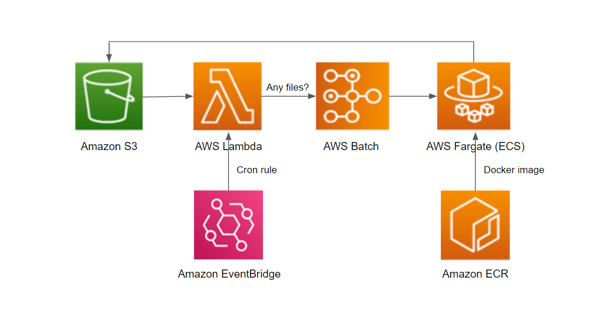

# Speech-to-Text batch inference with AWS serverless

This project is intended to give an alternative implementation of a Speech-to-Text solution in the cloud using [DeepSpeech](https://github.com/mozilla/DeepSpeech). The cloud providers do a great job building amazing Speech to Text solutions, but there may be some reasons for building a custom solution instead of using an off-the-shelf one:
- You may need a more fine tuned model.
- The cloud provider API can be much more expensive than the use of some open sources alternatives, depending on the volume of data to be processed.

## Solution architecture

## AWS deployment

### To deploy and run the solution, you need access to:
- An AWS account.
- A terminal with AWS Command Line Interface (CLI), CDK, Docker, git, and Python installed.

### Open a terminal and follow these steps:
1. Clone the GitHub repo  
`git clone https://github.com/rafaelsntn/speech-to-text-batch-inference-aws`  
`cd speech-to-text-batch-inference-aws`
2. Create a virtual environment:  
`python -m venv .venv`
3. Activate the virtual environment:  
In Linux:  
`source .venv/bin/activate`  
In Windows:  
`.venv\Scripts\activate.bat`
4. Once the virtualenv is activated, you can install the required dependencies:  
`pip install -r requirements.txt`
5. Deploy to AWS:  
`cdk deploy`

## Running inference
After deployment, you will see a new bucket in S3. To run the batch inference, you just need to upload the audio files with the extension ".wav". The file keys in the bucket will follow the pattern:
- {bucket-name}/input/{audio-file-name.wav}  
    Audio files that will be transcribed by DeepSpeech.
- {bucket-name}/output/{audio-file-name}  
    After processing the audio file, the text transcript will be saved here.
- {bucket-name}/processed/{audio-file.wav}  
    The processed files are moved from input to processed.
- {bucket-name}/child_job_input/{child_job_index}  
    These keys will be used by the Lambda function in order to distribute the workload between the child job instances.

The deployment will schedule a cron event via EventBridge to run the Lambda function at 1 a.m. (GMT). This function will submit the batch job if it finds any input in "/input" prefix. Otherwise, it exits without submitting the job, saving costs of compute instances. Alternatively, you can run the Lambda function directly in the AWS console.  

To run more than one instance simultaneously, increase the value of number_of_instances in lambda_files/check_files.py, up to 20 instances. You can increase this limit of instances deploying a compute environment with a bigger maxv_cpus in cdk_stacks/speech_to_text_stack.py. The Lambda function will use this number of instances to submit a array job with multiple child jobs, and will create files in S3 specifying the input for each child job.

## Cleaning up
To destroy all resources created by the CDK stack, run the following command inside the project folder from a terminal.  
`cdk destroy`

## License

This solution is licensed under the MIT-0 License. See the LICENSE file.